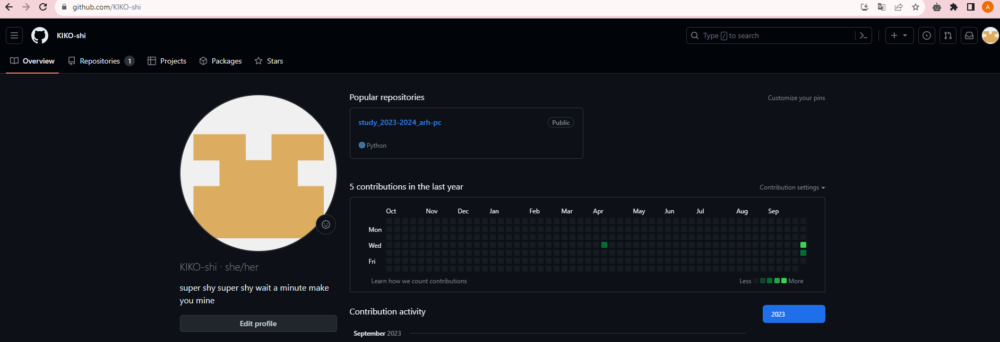
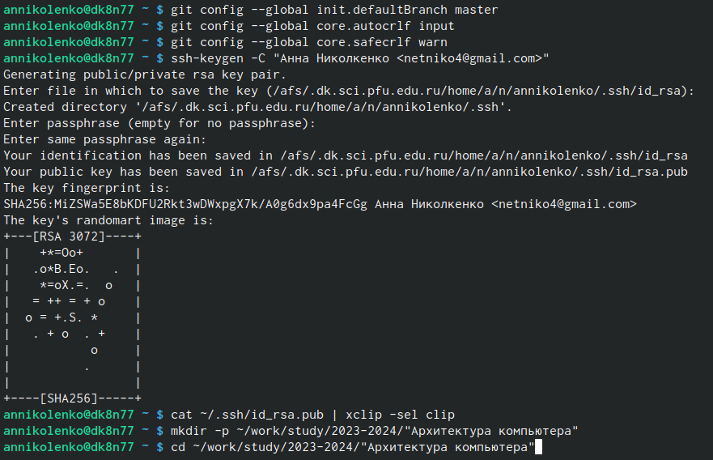
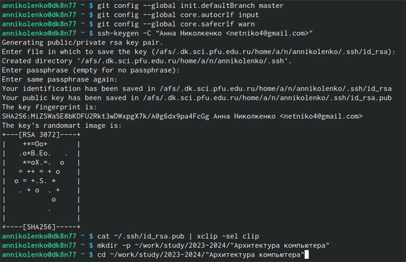
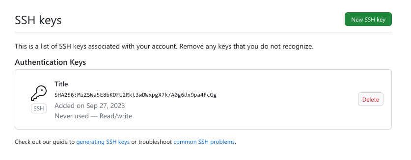
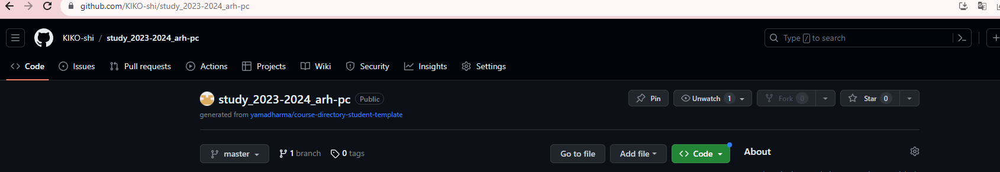
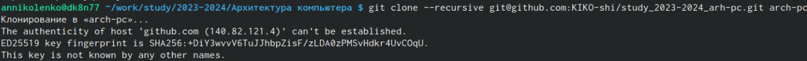
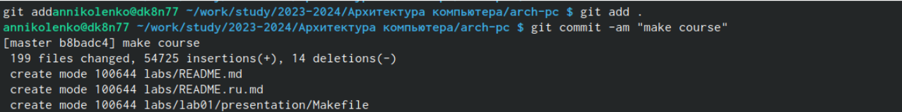
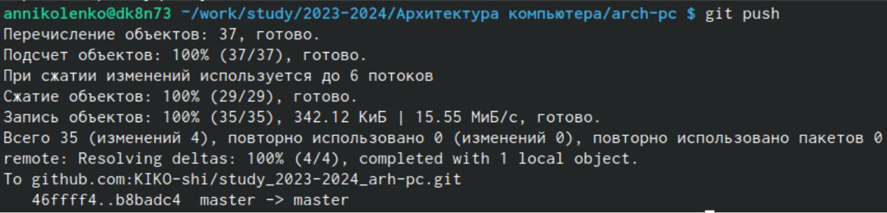
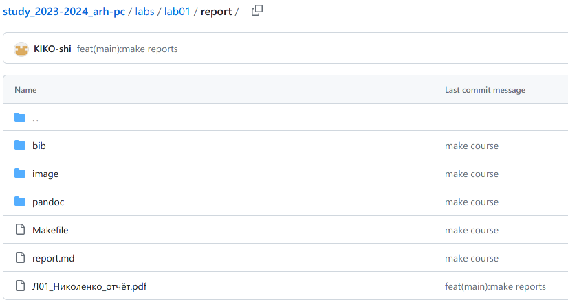

---
## Front matter
title: "Отчёт по лабороторной работе №2"
subtitle: "Архитектура компьютера"
author: "Николенко Анна Николаевна"

## Generic otions
lang: ru-RU
toc-title: "Содержание"

## Bibliography
bibliography: bib/cite.bib
csl: pandoc/csl/gost-r-7-0-5-2008-numeric.csl

## Pdf output format
toc: true # Table of contents
toc-depth: 2
lof: true # List of figures
lot: true # List of tables
fontsize: 12pt
linestretch: 1.5
papersize: a4
documentclass: scrreprt
## I18n polyglossia
polyglossia-lang:
  name: russian
  options:
	- spelling=modern
	- babelshorthands=true
polyglossia-otherlangs:
  name: english
## I18n babel
babel-lang: russian
babel-otherlangs: english
## Fonts
mainfont: PT Serif
romanfont: PT Serif
sansfont: PT Sans
monofont: PT Mono
mainfontoptions: Ligatures=TeX
romanfontoptions: Ligatures=TeX
sansfontoptions: Ligatures=TeX,Scale=MatchLowercase
monofontoptions: Scale=MatchLowercase,Scale=0.9
## Biblatex
biblatex: true
biblio-style: "gost-numeric"
biblatexoptions:
  - parentracker=true
  - backend=biber
  - hyperref=auto
  - language=auto
  - autolang=other*
  - citestyle=gost-numeric
## Pandoc-crossref LaTeX customization
figureTitle: "Рис."
tableTitle: "Таблица"
listingTitle: "Листинг"
lofTitle: "Список иллюстраций"
lotTitle: "Список таблиц"
lolTitle: "Листинги"
## Misc options
indent: true
header-includes:
  - \usepackage{indentfirst}
  - \usepackage{float} # keep figures where there are in the text
  - \floatplacement{figure}{H} # keep figures where there are in the text
---

# Цель работы

Цель работы заключается в ознакомлении с работой средств контроля версий и
в настройке git для начала работы. Используя git, создадаю рабочее пространство и
репозиторий курса, после чего загружаю файлы на github.

# Задание

1. Настройка github
2. Базовая настройка git
3. Создание SSH ключа
4. Создание рабочего пространства и репозитория курса на основе
шаблона
5. Сознание репозитория курса на основе шаблона
6. Настройка каталога курса
Здесь приводится описание задания в соответствии с рекомендациями

# Теоретическое введение

Система контроля версий — программное обеспечение, которое обеспечивает командную работу в рамках одного или нескольких проектов. Она хранит все версии проекта и обеспечивает к ним доступ. Любой член команды может взаимодействовать с основной «веткой» проекта или создавать новые. Среди классических VCS наиболее известны CVS, Subversion, а среди распределённых —
Git, Bazaar, Mercurial.

Системы контроля версий — это программные инструменты, помогающие командам разработчиков управлять изменениями в исходном коде с течением времени. 

Основные команды git
git pull - получение обновлений (изменений) текущего дерева из центрального
репозитория
git push - отправка всех произведённых изменений локального дерева в
центральный репозиторий
git add . - добавить все изменённые и/или созданные файлы и/или каталоги
git commit -am 'Описание коммита' - сохранить все добавленные изменения и все изменённые файлы

# Выполнение лабораторной работы

##Настройка github

Создаю учётную запись на сайте github и заполняю основные данные (рис. [-@fig:001]).

{#fig:001 width=70%}

##Базовая настройка git

Делаю предварительную конфигурацию git, указав имя и email владельца репозитория (рис. [-@fig:002]).

{#fig:002 width=70%}

Настраиваю utf-8 в выводе сообщений git (рис. [-@fig:003]).

{#fig:003 width=70%}

Задаю имя “мастер” для начальной ветки (рис. [-@fig:004]).

{#fig:004 width=70%}

Настраиваю параметры autocrlf и safecrlf (рис. [-@fig:005]).

{#fig:005 width=70%}

##Создание SSH ключа

Генерирую пару ключей (приватный и открытый) для последующей
идентификации пользователя на сервере репозиториев (рис. [-@fig:006]).

{#fig:006 width=70%}

Копирую из локальной консоли ключ в буфер обмена (рис. [-@fig:007]).

{#fig:007 width=70%}

Создаю SSH ключ, предварительно вставив ключ в появившееся на сайте поле и указав для ключа имя “Title” (рис. [-@fig:008]).

{#fig:008 width=70%}

##Создание рабочего пространства и репозитория курса

Создаю каталог для предмета «Архитектура компьютера» (рис. [-@fig:009]).

{#fig:009 width=70%}

Создаю репозиторий курса на основе шаблона через web-интерфейс github (рис. [-@fig:010]).

{#fig:010 width=70%}

Перехожу в каталог курса и клонирую созданный репозиторий (рис. [-@fig:011]), (рис. [-@fig:012]).

{#fig:011 width=70%}
{#fig:012 width=70%}

##Настройка каталога курса

Перехожу в каталог курса, удаляю лишние файлы, создаю необходимые каталоги (рис. [-@fig:013]).

{#fig:013 width=70%}

Ввожу команды git add . и git commit -am (рис. [-@fig:014]).

{#fig:014 width=70%}

Ввожу команду git push, чтобы отправить файлы на сервер (рис. [-@fig:015]).

{#fig:015 width=70%}

# Выполнение заданий для самостоятельной работы

Загружаю отчет первой лабораторной работы на github, предварительно
создав его в соответствующем каталоге рабочего пространства (labs>lab01>report) (рис. [-@fig:016]).

{#fig:016 width=70%}

# Выводы

Идеология и применение средств контроля версий изучены. После базовой
настройки git создала иерархию рабочего пространства в локальном репозитории и на
странице github.
