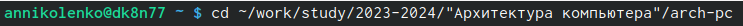
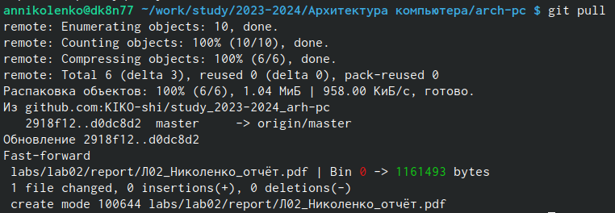
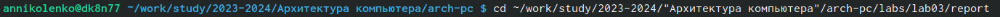
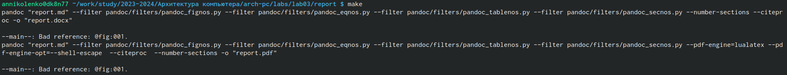
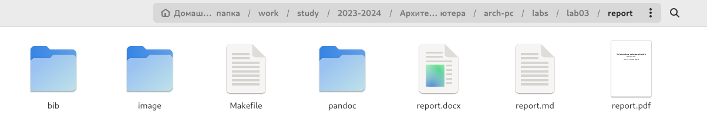
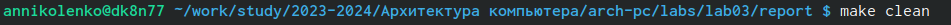
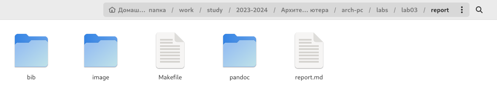
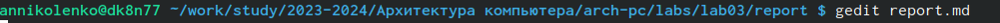

---
## Front matter
title: "Отчёт по лабороторной работе №3"
subtitle: "Архитектура компьютера"
author: "Николенко Анна Николаевна"

## Generic otions
lang: ru-RU
toc-title: "Содержание"

## Bibliography
bibliography: bib/cite.bib
csl: pandoc/csl/gost-r-7-0-5-2008-numeric.csl

## Pdf output format
toc: true # Table of contents
toc-depth: 2
lof: true # List of figures
lot: true # List of tables
fontsize: 12pt
linestretch: 1.5
papersize: a4
documentclass: scrreprt
## I18n polyglossia
polyglossia-lang:
  name: russian
  options:
	- spelling=modern
	- babelshorthands=true
polyglossia-otherlangs:
  name: english
## I18n babel
babel-lang: russian
babel-otherlangs: english
## Fonts
mainfont: PT Serif
romanfont: PT Serif
sansfont: PT Sans
monofont: PT Mono
mainfontoptions: Ligatures=TeX
romanfontoptions: Ligatures=TeX
sansfontoptions: Ligatures=TeX,Scale=MatchLowercase
monofontoptions: Scale=MatchLowercase,Scale=0.9
## Biblatex
biblatex: true
biblio-style: "gost-numeric"
biblatexoptions:
  - parentracker=true
  - backend=biber
  - hyperref=auto
  - language=auto
  - autolang=other*
  - citestyle=gost-numeric
## Pandoc-crossref LaTeX customization
figureTitle: "Рис."
tableTitle: "Таблица"
listingTitle: "Листинг"
lofTitle: "Список иллюстраций"
lotTitle: "Список таблиц"
lolTitle: "Листинги"
## Misc options
indent: true
header-includes:
  - \usepackage{indentfirst}
  - \usepackage{float} # keep figures where there are in the text
  - \floatplacement{figure}{H} # keep figures where there are in the text
---

# Цель работы

Цель работы заключается в ознакомлении с работой средств контроля версий и
в настройке git для начала работы. Используя git, создадаю рабочее пространство и
репозиторий курса, после чего загружаю файлы на github.

# Задание

1. В соответствующем каталоге сделайте отчёт по лабораторной работе No 2 в формате
Markdown. В качестве отчёта необходимо предоставить отчёты в 3 форматах: pdf, docx
и md.
2. Загрузите файлы на github.

# Теоретическое введение

## Базовые сведения о Markdown
Чтобы создать заголовок, используйте знак #
Чтобы задать для текста полужирное начертание, заключите его в двойные звездочки ** **
Чтобы задать для текста курсивное начертание, заключите его в одинарные звездочки * *
Чтобы задать для текста полужирное и курсивное начертание, заключите его в тройные
звездочки *** ***
Блоки цитирования создаются с помощью символа >
Упорядоченный список можно отформатировать с помощью соответствующих цифр.
Неупорядоченный (маркированный) список можно отформатировать с помощью звездочек или тире.

Синтаксис Markdown для встроенной ссылки состоит из части [ ], представляющей текст гиперссылки, и части (file-name.md) – URL-адреса или имени файла, на который
дается ссылка:
```
[link text](file-name.md)
```
или
```
[link text](http://example.com/ "Необязательная подсказка")
```
## Оформление изображений в Markdown
В Markdown вставить изображение в документ можно с помощью непосредственного
указания адреса изображения. Синтаксис данной команды выглядит следующим образом:
```
{#fig:fig1 width=70% }
```

Здесь:
• в квадратных скобках указывается подпись к изображению;
• в круглых скобках указывается URL-адрес или относительный путь изображения, а так-
же (необязательно) всплывающую подсказку, заключённую в двойные или одиночные
кавычки.
• в фигурных скобках указывается идентификатор изображения (#fig:fig1) для ссылки
на него по тексту и размер изображения относительно ширины страницы (width=90%)

## Обработка файлов в формате Markdown
Преобразовать файл README.md можно следующим образом:
pandoc README.md -o README.pdf

# Выполнение лабораторной работы

Открываю терминал, перехожу в каталог arch-pc (рис. [-@fig:001]).

{#fig:001 width=70%}

Обновляю локальный репозиторий, введя команду git pull (рис. [-@fig:002]).

{#fig:002 width=70%}

Перехожу в каталог с шаблоном отчёта по лабороторной работе №3 (рис. [-@fig:003]).

{#fig:003 width=70%}

Провожу компиляцию шаблона с использованием Makefile, введя команду make (рис. [-@fig:004]).

{#fig:004 width=70%}

Проверяю корректность полученных файлов через каталоги (рис. [-@fig:005]).

{#fig:005 width=70%}

Удаляю полученные файлы с использованием Makefile ранее, ввожу для этого команду make clean (рис. [-@fig:006]).

{#fig:006 width=70%}

Проверяю, что после этой команды файлы report.pdf и report.docx были удалены (рис. [-@fig:007]).

{#fig:007 width=70%}

Открываем файл report.md c помощью текстового редактора gedit (рис. [-@fig:008]).

{#fig:008 width=70%}

Заполнила отчет и скомпилировала его с использованием make. Проверила корректность полученных файлов. Загрузила файлы на Github.

# Выводы

Я освоила процедуры оформления отчетов с помощью легковесного языка разметки Markdown, а также ознакомилась с работой средств контроля версий и в настройке git для начала работы.
