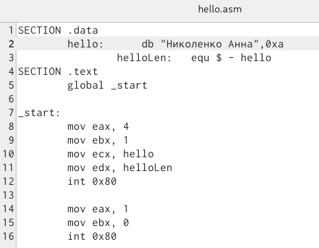
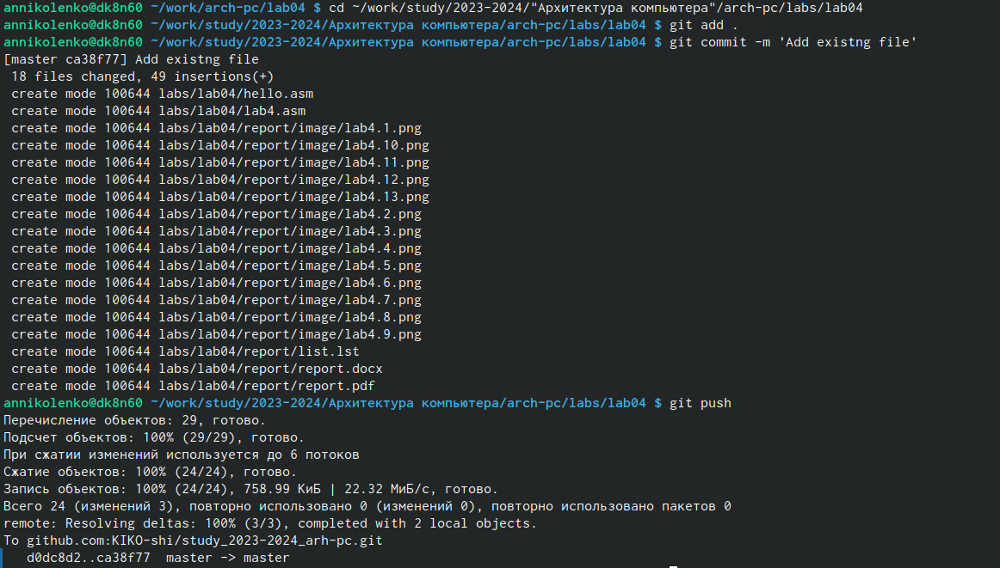

---
## Front matter
title: "Отчет по лабораторной работе №4"
subtitle: "Архитектура компьютера"
author: "Николенко Анна Николаевна"

## Generic otions
lang: ru-RU
toc-title: "Содержание"

## Bibliography
bibliography: bib/cite.bib
csl: pandoc/csl/gost-r-7-0-5-2008-numeric.csl

## Pdf output format
toc: true # Table of contents
toc-depth: 2
lof: true # List of figures
lot: true # List of tables
fontsize: 12pt
linestretch: 1.5
papersize: a4
documentclass: scrreprt
## I18n polyglossia
polyglossia-lang:
  name: russian
  options:
	- spelling=modern
	- babelshorthands=true
polyglossia-otherlangs:
  name: english
## I18n babel
babel-lang: russian
babel-otherlangs: english
## Fonts
mainfont: PT Serif
romanfont: PT Serif
sansfont: PT Sans
monofont: PT Mono
mainfontoptions: Ligatures=TeX
romanfontoptions: Ligatures=TeX
sansfontoptions: Ligatures=TeX,Scale=MatchLowercase
monofontoptions: Scale=MatchLowercase,Scale=0.9
## Biblatex
biblatex: true
biblio-style: "gost-numeric"
biblatexoptions:
  - parentracker=true
  - backend=biber
  - hyperref=auto
  - language=auto
  - autolang=other*
  - citestyle=gost-numeric
## Pandoc-crossref LaTeX customization
figureTitle: "Рис."
tableTitle: "Таблица"
listingTitle: "Листинг"
lofTitle: "Список иллюстраций"
lotTitle: "Список таблиц"
lolTitle: "Листинги"
## Misc options
indent: true
header-includes:
  - \usepackage{indentfirst}
  - \usepackage{float} # keep figures where there are in the text
  - \floatplacement{figure}{H} # keep figures where there are in the text
---

# Цель работы

Цель работы заключается в освоении процедуры компиляции и сборки программ, написанных на ассемблере NASM.

# Задание

вывести программу "Hello world!" и своё ФИО.

# Теоретическое введение

Основными функциональными элементами любой электронно-вычислительной машины
(ЭВМ) являются центральный процессор, память и периферийные устройства (рис. 4.1).
Взаимодействие этих устройств осуществляется через общую шину, к которой они подклю-
чены. Физически шина представляет собой большое количество проводников, соединяющих
устройства друг с другом. В современных компьютерах проводники выполнены в виде элек-
тропроводящих дорожек на материнской (системной) плате.
Основной задачей процессора является обработка информации, а также организация
координации всех узлов компьютера. В состав центрального процессора (ЦП) входят
следующие устройства:
• арифметико-логическое устройство (АЛУ) — выполняет логические и арифметиче-
ские действия, необходимые для обработки информации, хранящейся в памяти;
• устройство управления (УУ) — обеспечивает управление и контроль всех устройств
компьютера;
• регистры — сверхбыстрая оперативная память небольшого объёма, входящая в со-
став процессора, для временного хранения промежуточных результатов выполнения
инструкций; регистры процессора делятся на два типа: регистры общего назначения и
специальные регистры.

# Выполнение лабораторной работы

Создаю каталог для работы с программами на языке ассемблера NASM, перехожу в этот каталог и создаю текстовый файл с именем hello.asm (рис. @fig:001).

{#fig:001 width=70%}

Открываю этот файл с помощью текстового редактора gedit и ввожу в него текст из лабораторной работы (рис. @fig:002).

{#fig:002 width=70%}

Для компиляции приведённого выше текста программы «Hello World» пишу команду nasm -f elf hello.asm, с помощью команды ls проверяю, что объектный файл был создан (рис. @fig:003).

{#fig:003 width=70%}

Компилирую исходный файл hello.asm в obj.o с помощью команды nasm -o obj.o -f elf -g -l list.lst hello.asm. С помощью команды ls проверьте, что файлы были созданы (рис. @fig:004).

{#fig:004 width=70%}

Чтобы получить исполняемую программу, необходимо передать на обработку компоновщику объектный файл с помощью команды: ld -m elf_i386 hello.o -o hello. А затем с помощью команды ls проверяю, что исполняемый файл hello был создан (рис. @fig:005).

{#fig:005 width=70%}

Выполните следующую команду, задаю в данном случае имя создаваемого исполняемого файла:ld -m elf_i386 obj.o -o main (рис. @fig:006).

{#fig:006 width=70%}

Запускаю на выполнение созданный исполняемый файл (рис. @fig:007).

{#fig:007 width=70%}

#Выполнение заданий для самостоятельной работы

В каталоге ~/work/arch-pc/lab04 с помощью команды cp создаю копию файла
hello.asm с именем lab4.asm (рис. @fig:008).

{#fig:008 width=70%}

С помощью текстового редактора gedit (рис. @fig:009) вношу изменения в текст программы в
файле lab4.asm: вместо Hello world! пишу мои фамилию и имя. На экран теперь будет выводиться строка с моими фамилией и именем (рис. @fig:010).

{#fig:009 width=70%}
{#fig:010 width=70%}

Оттранслирываю полученный текст программы lab4.asm в объектный файл. Выполняю
компоновку объектного файла и запускаю получившийся исполняемый файл (рис. @fig:011), (рис. @fig:012).

{#fig:011 width=70%}
{#fig:012 width=70%}

Копирую файлы hello.asm и lab4.asm в свой локальный репозиторий в каталог ~/work/study/2023-2024/"Архитектура компьютера"/arch-pc/labs/lab04/ (рис. @fig:013).

{#fig:013 width=70%}

Загружаю файлы на Github (рис. @fig:014).
{#fig:014 width=70%}

# Выводы

Я освоила процедуры компиляции и сборки программ, написанных на ассемблере NASM.

