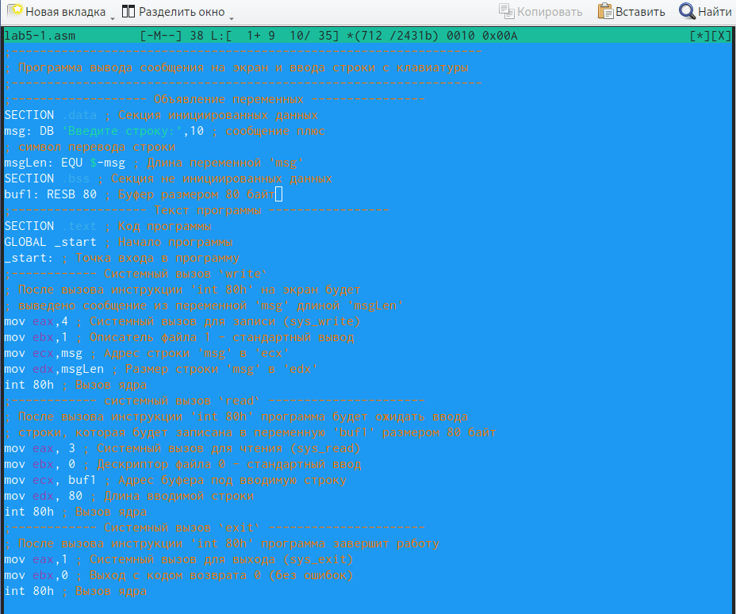
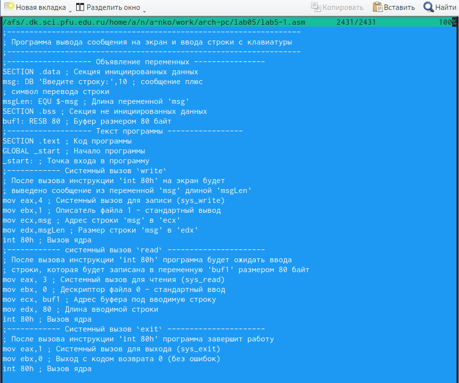
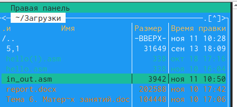
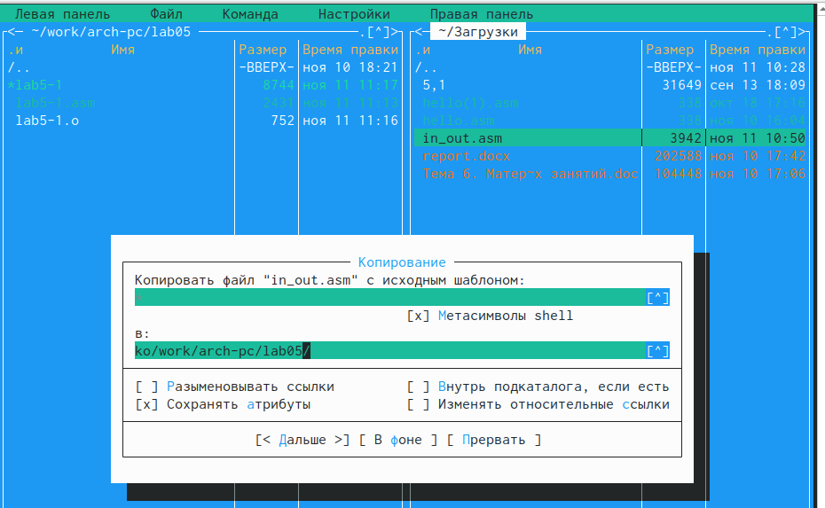
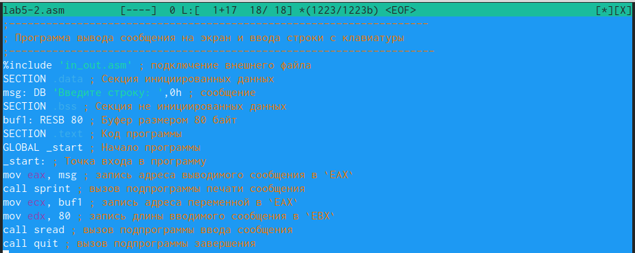
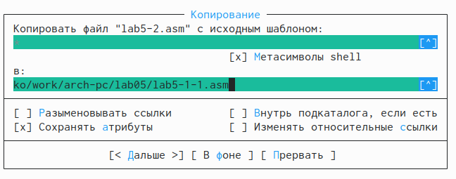
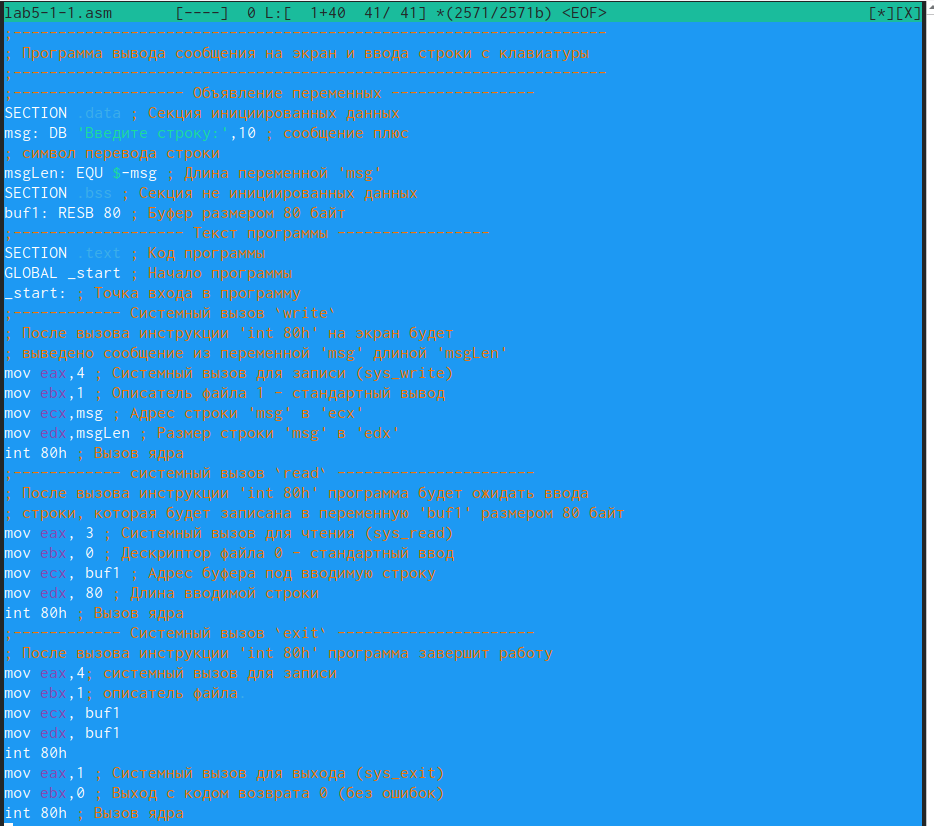
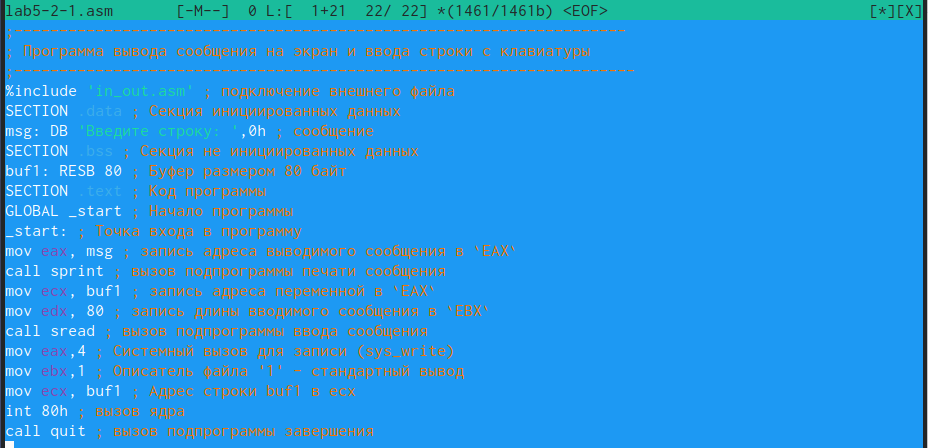

---
## Front matter
title: "Отчет по лабораторной работе №5"
subtitle: "Архитектура компьютера"
author: "Николенко Анна Николаевна"

## Generic otions
lang: ru-RU
toc-title: "Содержание"

## Bibliography
bibliography: bib/cite.bib
csl: pandoc/csl/gost-r-7-0-5-2008-numeric.csl

## Pdf output format
toc: true # Table of contents
toc-depth: 2
lof: true # List of figures
lot: true # List of tables
fontsize: 12pt
linestretch: 1.5
papersize: a4
documentclass: scrreprt
## I18n polyglossia
polyglossia-lang:
  name: russian
  options:
	- spelling=modern
	- babelshorthands=true
polyglossia-otherlangs:
  name: english
## I18n babel
babel-lang: russian
babel-otherlangs: english
## Fonts
mainfont: PT Serif
romanfont: PT Serif
sansfont: PT Sans
monofont: PT Mono
mainfontoptions: Ligatures=TeX
romanfontoptions: Ligatures=TeX
sansfontoptions: Ligatures=TeX,Scale=MatchLowercase
monofontoptions: Scale=MatchLowercase,Scale=0.9
## Biblatex
biblatex: true
biblio-style: "gost-numeric"
biblatexoptions:
  - parentracker=true
  - backend=biber
  - hyperref=auto
  - language=auto
  - autolang=other*
  - citestyle=gost-numeric
## Pandoc-crossref LaTeX customization
figureTitle: "Рис."
tableTitle: "Таблица"
listingTitle: "Листинг"
lofTitle: "Список иллюстраций"
lotTitle: "Список таблиц"
lolTitle: "Листинги"
## Misc options
indent: true
header-includes:
  - \usepackage{indentfirst}
  - \usepackage{float} # keep figures where there are in the text
  - \floatplacement{figure}{H} # keep figures where there are in the text
---

# Цель работы

Цель работы заключапется в приобретении практических навыков работы в Midnight Commander. Освоение инструкций языка ассемблера mov и int.

# Задание

1. Основы работы 
2. Структура программы на языке ассемблера NASM
3. Подключение внешнего файла
4. Выполнение заданий для самостоятельной работы

# Теоретическое введение

Midnight Commander — один из файловых менеджеров с текстовым интерфейсом типа Norton Commander для UNIX-подобных операционных систем. MC позволяет просматривать структуру каталогов и выполнять основные операции по управлению файловой системой/
Программа на языке ассемблера NASM, как правило, состоит из трёх секций: секция кода программы (SECTION .text), секция инициированных (известных во время компиляции) данных (SECTION .data) и секция неинициализированных данных (тех, под которые во время компиляции только отводится память, а значение присваивается в ходе выполнения программы) (SECTION .bss). 

Для объявления инициированных данных в секции .data используются директивы DB, DW,
DD, DQ и DT, которые резервируют память и указывают, какие значения должны храниться в
этой памяти:
* DB (define byte) — определяет переменную размером в 1 байт;
* DW (define word) — определяет переменную размеров в 2 байта (слово);
* DD (define double word) — определяет переменную размером в 4 байта (двойное слово);
* DQ (define quad word) — определяет переменную размером в 8 байт (учетверённое слово);
* DT (define ten bytes) — определяет переменную размером в 10 байт.
Директивы используются для объявления простых переменных и для объявления массивов. Для определения строк принято использовать директиву DB в связи с особенностями
хранения данных в оперативной памяти.

Для определения строк принято использовать директиву DB в связи с особенностями хранения данных в оперативной памяти. Инструкция языка ассемблера mov предназначена для дублирования данных источника в приёмнике.
mov dst,src
Здесь операнд dst — приёмник, а src — источник. 

В качестве операнда могут выступать регистры (register), ячейки памяти (memory) и непосредственные значения (const). Инструкция языка ассемблера intпредназначена для вызова прерывания с указанным номером.
int n
Здесь n — номер прерывания, принадлежащий диапазону 0–255. 
При программировании в Linux с использованием вызовов ядра sys_calls n=80h (принято задавать в шестнадцатеричной системе счисления).

# Выполнение лабораторной работы
## Основы работы с mc

Открываю Midnight Commander, введя в терминал mc (рис. [-@fig:001]).

{#fig:001 width=70%}

Перехожу в каталог ~/work/study/2023-2024/Архитектура Компьютера/arch-pc, используя файловый менеджер mc  (рис. [-@fig:002]).

{#fig:002 width=70%}

С помощью функциональной клавиши F7 создаю каталог lab05 и перехожу в него (рис. [-@fig:003]).

{#fig:003 width=70%}

Перехожу в этот каталог (рис. [-@fig:004]).

{#fig:004 width=70%}

В строке ввода создаю файл с помощю команды touch lab5-1.asm, в нем буду работать (рис. [-@fig:005]).

{#fig:005 width=70%}

## Структура программы на языке ассемблера NASM

С помощью функциональной клавиши F4 открываю созданный файл для редактирования в редакторе mcedit (рис. [-@fig:006]).

{#fig:006 width=70%}

Ввожу в файл код программы для запроса строки у пользователя. Далее выхожу из файла (F10), предварительно сохранив изменения (F2). (рис. [-@fig:007]).

{#fig:007 width=70%}

С помощью функциональной клавиши F3 открываю файл для просмотра, чтобы проверить, содержит ли файл текст программы (рис. [-@fig:008]).

{#fig:008 width=70%}

Транслирую текст программы файла в объектный файл командой nasm -f elf lab5-1.asm. Создался объектный файл lab5-1.o. Выполняю компоновку объектного файла с помощью команды ld -m elf_i386 -o lab5-1 lab5-1.o. Создался исполняемый файл lab5-1. На запрос ввожу свою ФИО (рис. [-@fig:009]).

{#fig:009 width=70%}

## Подключение внешнего файла in_out.asm

Скачиваю файл in_out.asm со страницы курса в ТУИС. Он сохранился в каталог “Загрузки” (рис. [-@fig:010]).

{#fig:010 width=70%}

С помощью функциональной клавиши F5 копирую файл in_out.asm из каталога Загрузки в созданный каталог lab05 (рис. [-@fig:011]).

{#fig:011 width=70%}

С помощью функциональной клавиши F6 создаю копию файла lab5-1.asm с именем
lab5-2.asm (рис. [-@fig:012]).

{#fig:012 width=70%}

Изменяю содержимое файла lab5-2.asm во встроенном редакторе mcedit, чтобы в программе использовались подпрограммы из внешнего файла in_out.asm (рис. [-@fig:013]).

{#fig:013 width=70%}

Транслирую текст программы файла в объектный файл командой nasm -f elf lab5-2.asm (рис. [-@fig:014]). Создался объектный файл lab5-2.o. Выполняю компоновку объектного файла с помощью команды ld -m elf_i386 -o lab5-2 lab5-2.o Создался исполняемый файл lab5-2. Запускаю исполняемый файл, чтобы проверить его работу (рис. [-@fig:015]).

{#fig:014 width=70%}
{#fig:015 width=70%}

Открываю файл lab5-2.asm для редактирования в mcedit функциональной клавишей F4. Изменяю в нем подпрограмму sprintLF на sprint. Сохраняю изменения (рис. [-@fig:016]).

{#fig:016 width=70%}

Транслирую файл, выполняю компоновку созданного объектного файла, запускаю новый исполняемый файл (рис. [-@fig:017]).

{#fig:017 width=70%}

Разница между первым исполняемым файлом и вторым в том, что запуск первого запрашивает ввод с новой строки, а при запуске второго, запрашивает ввод без переноса на новую строку, потому что в этом заключается различие между подпрограммами sprintLF и sprint.

# Выполнение заданий для самостоятельной работы

Создаю копию файла lab5-1.asm с именем lab5-1-1.asm с помощью функциональной клавиши F5 (рис. [-@fig:018]).

{#fig:018 width=70%}

Предварительно открыв созданный файл, изменяю программу так, чтобы кроме вывода приглашения и запроса ввода, она выводила вводимую пользователем строку (без использова-
ния внешнего файла in_out.asm) (рис. [-@fig:019]).

{#fig:019 width=70%}

Создаю объектный файл lab5-1-1.o, отдаю его на обработку компоновщику, получаю исполняемый файл lab5-1-1, запускаю полученный исполняемый файл. Программа запрашивает ввод, ввожу свои ФИО, далее программа выводит введенные мною данные  (рис. [-@fig:020]).

{#fig:020 width=70%}

Создаю копию файла lab5-2.asm под названием lab5-2-1.asm. (рис. [-@fig:021]).

{#fig:021 width=70%}

Предварительно открыв созданный файл, изменяю программу так, чтобы кроме вывода приглашения и запроса ввода, она выводила вводимую пользователем строку с использование под-
программ из внешнего файла in_out.asm (рис. [-@fig:021]).

{#fig:022 width=70%}

Создаю исполняемый файл и проверяю его работу (рис. [-@fig:023]).

{#fig:023 width=70%}

#Листинги написанных программ  

1. Программа вывода сообщения на экран и ввода строки с клавиатуры

;------------------------------------------------------------------
; Программа вывода сообщения на экран и ввода строки с клавиатуры
;------------------------------------------------------------------
;------------------- Объявление переменных ----------------
SECTION .data ; Секция инициированных данных
msg: DB 'Введите строку:',10 ; сообщение плюс
; символ перевода строки
msgLen: EQU $-msg ; Длина переменной 'msg'
SECTION .bss ; Секция не инициированных данных
buf1: RESB 80 ; Буфер размером 80 байт
;------------------- Текст программы -----------------
SECTION .text ; Код программы
GLOBAL _start ; Начало программы
_start: ; Точка входа в программу
;------------ Cистемный вызов `write`
; После вызова инструкции 'int 80h' на экран будет
; выведено сообщение из переменной 'msg' длиной 'msgLen'
mov eax,4 ; Системный вызов для записи (sys_write)
mov ebx,1 ; Описатель файла 1 - стандартный вывод
mov ecx,msg ; Адрес строки 'msg' в 'ecx'
mov edx,msgLen ; Размер строки 'msg' в 'edx'
int 80h ; Вызов ядра
;------------ системный вызов `read` ----------------------
; После вызова инструкции 'int 80h' программа будет ожидать ввода
; строки, которая будет записана в переменную 'buf1' размером 80 байт
mov eax, 3 ; Системный вызов для чтения (sys_read)
mov ebx, 0 ; Дескриптор файла 0 - стандартный ввод
mov ecx, buf1 ; Адрес буфера под вводимую строку
mov edx, 80 ; Длина вводимой строки
int 80h ; Вызов ядра
;------------ Системный вызов `exit` ----------------------
; После вызова инструкции 'int 80h' программа завершит работу
mov eax,1 ; Системный вызов для выхода (sys_exit)
mov ebx,0 ; Выход с кодом возврата 0 (без ошибок)
int 80h ; Вызов ядра

2. внешнего файла in_out.asm

;---------------   slen  -------------------
; Функция вычисления длины сообщения
slen:                     
    push    ebx             
    mov     ebx, eax        
    
nextchar:                   
    cmp     byte [eax], 0   
    jz      finished        
    inc     eax             
    jmp     nextchar        
    
finished:
    sub     eax, ebx
    pop     ebx             
    ret                     

;---------------  sprint  -------------------
; Функция печати сообщения
; входные данные: mov eax,<message>
sprint:
    push    edx
    push    ecx
    push    ebx
    push    eax
    call    slen
    
    mov     edx, eax
    pop     eax
    
    mov     ecx, eax
    mov     ebx, 1
    mov     eax, 4
    int     80h

    pop     ebx
    pop     ecx
    pop     edx
    ret

;----------------  sprintLF  ----------------
; Функция печати сообщения с переводом строки
; входные данные: mov eax,<message>
sprintLF:
    call    sprint

    push    eax
    mov     eax, 0AH
    push    eax
    mov     eax, esp
    call    sprint
    pop     eax
    pop     eax
    ret

;---------------  sread  ----------------------
; Функция считывания сообщения

3. Программа вывода сообщения на экран и ввода строки с клавиатуры c
использованием файла in_out.asm

;--------------------------------------------------------------------
; Программа вывода сообщения на экран и ввода строки с клавиатуры
;---------------------------------------------------------------------
%include 'in_out.asm' ; подключение внешнего файла
SECTION .data ; Секция инициированных данных
msg: DB 'Введите строку: ',0h ; сообщение
SECTION .bss ; Секция не инициированных данных
buf1: RESB 80 ; Буфер размером 80 байт
SECTION .text ; Код программы
GLOBAL _start ; Начало программы
_start: ; Точка входа в программу
mov eax, msg ; запись адреса выводимого сообщения в `EAX`
call sprintLF ; вызов подпрограммы печати сообщения
mov ecx, buf1 ; запись адреса переменной в `EAX`
mov edx, 80 ; запись длины вводимого сообщения в `EBX`
56 Демидова А. В.
Архитектура ЭВМ
call sread ; вызов подпрограммы ввода сообщения
call quit ; вызов подпрограммы завершения

4. Программа вывода сообщения на экран и ввода строки с клавиатуры без переноса на новую строку c использованием файла in_out.asm (замена подпрограммы sprintLF на sprint)

;--------------------------------------------------------------------
; Программа вывода сообщения на экран и ввода строки с клавиатуры
;---------------------------------------------------------------------
%include 'in_out.asm' ; подключение внешнего файла
SECTION .data ; Секция инициированных данных
msg: DB 'Введите строку: ',0h ; сообщение
SECTION .bss ; Секция не инициированных данных
buf1: RESB 80 ; Буфер размером 80 байт
SECTION .text ; Код программы
GLOBAL _start ; Начало программы
_start: ; Точка входа в программу
mov eax, msg ; запись адреса выводимого сообщения в `EAX`
call sprint ; вызов подпрограммы печати сообщения
mov ecx, buf1 ; запись адреса переменной в `EAX`
mov edx, 80 ; запись длины вводимого сообщения в `EBX`
56 Демидова А. В.
Архитектура ЭВМ
call sread ; вызов подпрограммы ввода сообщения
call quit ; вызов подпрограммы завершения

5. Код программы из пункта 1 самостоятельной работы:

SECTION .data ; Секция инициированных данных
msg: DB 'Введите строку:',10
msgLen: EQU $-msg ; Длина переменной 'msg'
SECTION .bss ; Секция не инициированных данных
buf1: RESB 80 ; Буфер размером 80 байт
SECTION .text ; Код программы
GLOBAL _start ; Начало программы
_start: ; Точка входа в программу
mov eax,4 ; Системный вызов для записи (sys_write)
mov ebx,1 ; Описатель файла 1 - стандартный вывод
mov ecx,msg ; Адрес строки 'msg' в 'ecx'
mov edx,msgLen ; Размер строки 'msg' в 'edx'
int 80h ; Вызов ядра
mov eax, 3 ; Системный вызов для чтения (sys_read)
mov ebx, 0 ; Дескриптор файла 0 - стандартный ввод
mov ecx, buf1 ; Адрес буфера под вводимую строку
mov edx, 80 ; Длина вводимой строки
int 80h ; Вызов ядра
mov eax,4 ; Системный вызов для записи (sys_write)
mov ebx,1 ; Описатель файла '1' - стандартный вывод
mov ecx,buf1 ; Адрес строки buf1 в ecx
mov edx,buf1 ; Размер строки buf1
int 80h ; Вызов ядра
mov eax,1 ; Системный вызов для выхода (sys_exit)
mov ebx,0 ; Выход с кодом возврата 0 (без ошибок)
int 80h ; Вызов ядра

6. Код программы из пункта 3 самостоятельной работы:

%include 'in_out.asm'
SECTION .data ; Секция инициированных данных
msg: DB 'Введите строку: ',0h ; сообщение
SECTION .bss ; Секция не инициированных данных
buf1: RESB 80 ; Буфер размером 80 байт
SECTION .text ; Код программы
GLOBAL _start ; Начало программы
_start: ; Точка входа в программу
mov eax, msg ; запись адреса выводимого сообщения в `EAX`
call sprint ; вызов подпрограммы печати сообщения
mov ecx, buf1 ; запись адреса переменной в `EAX`
mov edx, 80 ; запись длины вводимого сообщения в `EBX`
call sread ; вызов подпрограммы ввода сообщения
mov eax,4 ; Системный вызов для записи (sys_write)
mov ebx,1 ; Описатель файла '1' - стандартный вывод
mov ecx,buf1 ; Адрес строки buf1 в ecx
int 80h ; Вызов ядра
call quit ; вызов подпрограммы завершения

# Выводы

При выполнении данной лабораторной работы я приобрела практические навыки работы в Midnight Commander, а также освоила инструкции языка ассемблера mov и int.
