---
## Front matter
title: "Отчет по лабораторной работе №5"
subtitle: "Архитектура компьютера"
author: "Николенко Анна Николаевна"

## Generic otions
lang: ru-RU
toc-title: "Содержание"

## Bibliography
bibliography: bib/cite.bib
csl: pandoc/csl/gost-r-7-0-5-2008-numeric.csl

## Pdf output format
toc: true # Table of contents
toc-depth: 2
lof: true # List of figures
lot: true # List of tables
fontsize: 12pt
linestretch: 1.5
papersize: a4
documentclass: scrreprt
## I18n polyglossia
polyglossia-lang:
  name: russian
  options:
	- spelling=modern
	- babelshorthands=true
polyglossia-otherlangs:
  name: english
## I18n babel
babel-lang: russian
babel-otherlangs: english
## Fonts
mainfont: PT Serif
romanfont: PT Serif
sansfont: PT Sans
monofont: PT Mono
mainfontoptions: Ligatures=TeX
romanfontoptions: Ligatures=TeX
sansfontoptions: Ligatures=TeX,Scale=MatchLowercase
monofontoptions: Scale=MatchLowercase,Scale=0.9
## Biblatex
biblatex: true
biblio-style: "gost-numeric"
biblatexoptions:
  - parentracker=true
  - backend=biber
  - hyperref=auto
  - language=auto
  - autolang=other*
  - citestyle=gost-numeric
## Pandoc-crossref LaTeX customization
figureTitle: "Рис."
tableTitle: "Таблица"
listingTitle: "Листинг"
lofTitle: "Список иллюстраций"
lotTitle: "Список таблиц"
lolTitle: "Листинги"
## Misc options
indent: true
header-includes:
  - \usepackage{indentfirst}
  - \usepackage{float} # keep figures where there are in the text
  - \floatplacement{figure}{H} # keep figures where there are in the text
---

# Цель работы

Цель данной лабораторной работы - освоение арифметческих инструкций языка ассемблера NASM.

# Задание

1. Символьные и численные данные в NASM
2. Выполнение арифметических операций в NASM
3. Выполнение заданий для самостоятельной работы

# Теоретическое введение

Большинство инструкций на языке ассемблера требуют обработки операндов. Адрес операнда предоставляет место, где хранятся данные, подлежащие обработке. Это могут быть данные хранящиеся в регистре или в ячейке памяти. 

Основные способы адресации:
* Регистровая адресация – операнды хранятся в регистрах и в команде используются имена этих регистров, например: mov ax,bx. 
* Непосредственная адресация – значение операнда задается непосредственно в команде, Например: mov ax,2.
* Адресация памяти – операнд задает адрес в памяти. В команде указывается символическое обозначение ячейки памяти, над содержимым которой требуется выполнить операцию.

Арифметические операции в NASM:
* Целочисленное сложение - add.
* Целочисленное вычитание - sub.
* Команды инкремент(inc)- прибавление единицы к операнду и декремент(dec)- вычитание единицы. Они выгодны тем, что они занимают меньше места, чем соответствующие команды сложения и вычитания.
* Команда изменения знака операнда - neg.
* Команды умножения - mul (для беззнакового умножения) и imul (для знакового умножения).
* Команды деления div и idiv.

Ввод информации с клавиатуры и вывод её на экран осуществляется в символьном виде. Кодирование этой информации производится согласно кодовой таблице символов ASCII. Согласно стандарту ASCII каждый символ кодируется одним байтом. Среди инструкций NASM нет такой, которая выводит числа (не в символьном виде). Поэтому, например, чтобы вывести число, надо предварительно преобразовать его цифры в ASCII-коды этих цифр и выводить на экран эти коды, а не само число. Если же выводить число на экран непосредственно, то экран воспримет его не как число, а как последовательность ASCII-символов – каждый байт числа будет воспринят как один ASCII-символ – и выведет на экран эти символы. Аналогичная ситуация происходит и при вводе данных с клавиатуры. Введенные данные будут представлять собой символы, что сделает невозможным получение корректного результата при выполнении над ними арифметических операций. Для решения этой проблемы необходимо проводить преобразование ASCII символов в числа и обратно

* iprint – вывод на экран чисел в формате ASCII.
* iprintLF – работает аналогично iprint, но при выводе на экран после числа добавляет
к символ перевода строки.

# Выполнение лабораторной работы

## Символьные и численные данные в NASM

Создаю каталог для программам лабораторной работы No 6, перехожу в него и создаю файл lab6-1.asm (рис. [-@fig:001]).

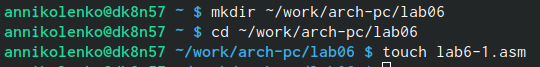{#fig:001 width=70%}

Копирую в текущий каталог файл in_out.asm с помощью команды cp, т.к. он будет использоваться в других программах (рис. [-@fig:002]).

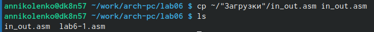{#fig:002 width=70%}

Открываю файл lab6-1.asm и ввожу в него программу вывода значения регистра eax (рис. [-@fig:003]).

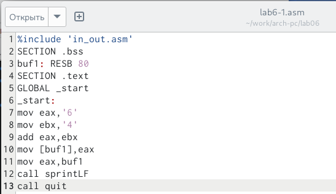{#fig:003 width=70%}

Создайте исполняемый файл и запустите его. Вывод программы: символ j, потому что программа вывела символ, соответствующий по системе ASCII сумме двоичных кодов символов 4 и 6 (рис. [-@fig:004]).

{#fig:004 width=70%}

Изменяю в тексте программы символы “6” и “4” на цифры 6 и 4  (рис. [-@fig:005]).

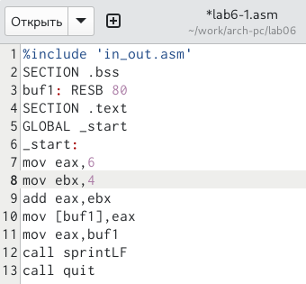{#fig:005 width=70%}

Создаю новый исполняемый файл программы и запускаю его. Выводится символ с кодом 10, это символ перевода строки. Этот символ не отображается при выводе на экран (рис. [-@fig:006]).

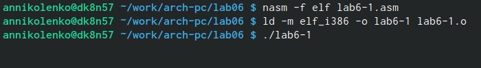{#fig:006 width=70%}

Создаю новый файл lab6-2.asm с помощью команды touch (рис. [-@fig:007]).

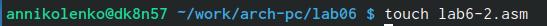{#fig:007 width=70%}

Ввожу в файл текст другой программы для вывода значения регистра eax (рис. [-@fig:008]).

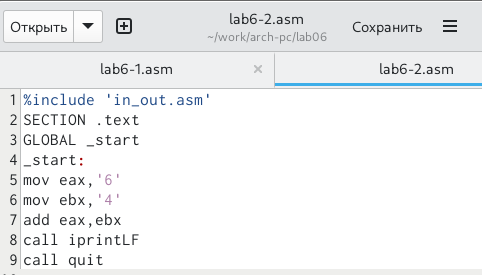{#fig:008 width=70%}

Создаю и запускаю исполняемый файл lab6-2. Теперь вывод число 106, потому что программа позволяет вывести именно число, а не символ, хотя все еще происходит именно сложение кодов символов “6” и “4” (рис. [-@fig:009]).

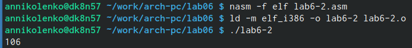{#fig:009 width=70%}

Заменяю в тексте программы в файле lab6-2.asm символы “6” и “4” на числа 6 и 4 (рис. [-@fig:010]).

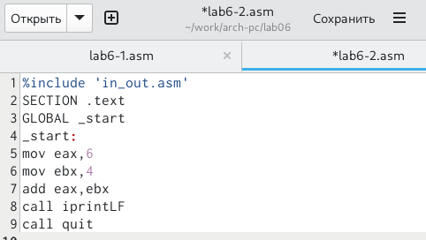{#fig:010 width=70%}

Создаю и запускаю новый исполняемый файл. Теперь программа складывает не соответствующие символам коды в системе ASCII, а сами числа, поэтому вывод 10 (рис. [-@fig:011]).

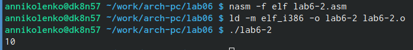{#fig:011 width=70%}

Создаю и запускаю новый исполняемый файл. Теперь программа складывает не соответствующие символам коды в системе ASCII, а сами числа, поэтому вывод 10 (рис. [-@fig:011]).

{#fig:011 width=70%}

Заменяю в тексте программы функцию iprintLF на iprint (рис. [-@fig:012]).

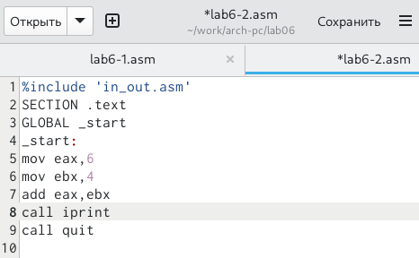{#fig:012 width=70%}

Создаю и запускаю новый исполняемый файл. Вывод не изменился, потому что символ переноса строки не отображался, когда программа исполнялась с функцией iprintLF, а iprint не добавляет к выводу символ переноса строки, в отличие от iprintLF. (рис. [-@fig:013]).

{#fig:013 width=70%}

## Выполнение арифметических операций в NASM

Создаю файл lab6-3.asm с помощью утилиты touch (рис. [-@fig:014]).

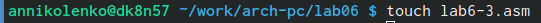{#fig:014 width=70%}

Ввожу в созданный файл текст программы для вычисления значения выражения f(x) = (5 * 2 + 3)/3 (рис. [-@fig:015]).

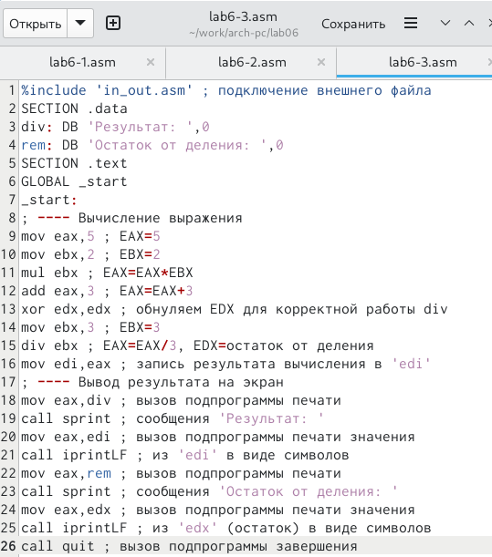{#fig:015 width=70%}

Создаю исполняемый файл и запускаю его (рис. [-@fig:016]).

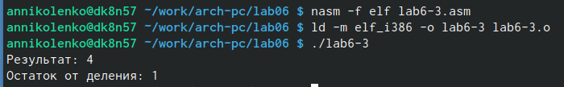{#fig:016 width=70%}

Изменяю программу так, чтобы она вычисляла значение выражения f(x) = (4 * 6 + 2)/5 (рис. [-@fig:017]).

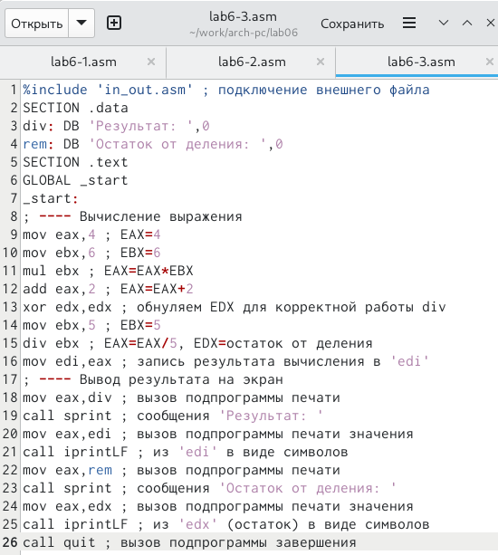{#fig:017 width=70%}

Создаю и запускаю новый исполняемый файл (рис. 19). Провериала его работту (корректность ответа), решив уравнение самостоятельно (рис. [-@fig:018]).

{#fig:018 width=70%}

Создаю файл variant.asm с помощью команды touch (рис. [-@fig:019]).

{#fig:019 width=70%}

Ввожу в файл текст программы для вычисления варианта задания по номеру студенческого билета (рис. [-@fig:020]).

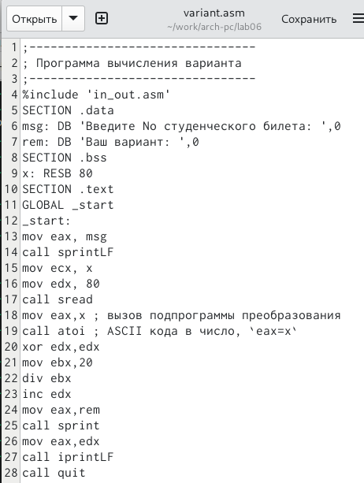{#fig:020 width=70%}

Создаю и запускаю исполняемый файл. Ввожу номер своего студ. билета с клавиатуры, программа вывела, что мой вариант - 15 (рис. [-@fig:021]).

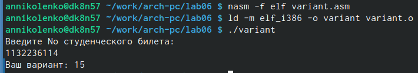{#fig:021 width=70%}

# Ответы на вопросы

1. За вывод сообщения “Ваш вариант” отвечают строки кода:
mov eax,rem
call sprint
2. mov ecx, x - используется, чтобы положить адрес вводимой строки x в регистр ecx 
mov edx, 80 - запись в регистр edx длины вводимой строки 
call sread - вызов подпрограммы из внешнего файла, обеспечивающей ввод сообщения с клавиатуры
3. call atoi - вызов подпрограммы из внешнего файла, которая преобразует ascii-код символа в целое число и записывает результат в регистр eax
4. За вычисления варианта отвечают строки:
xor edx,edx ; обнуление edx для корректной работы div
mov ebx,20 ; ebx = 20
div ebx ; eax = eax/20, edx - остаток от деления
inc edx ; edx = edx + 1
5. При выполнении инструкции div ebx остаток от деления записывается в регистр edx
6. Инструкция inc edx прибавляет 1 к значению регистра edx
7. За вывод на экран результатов вычислений отвечают строки:
mov eax,edx
call iprintLF

# Выполнение заданий для самостоятельной работы

Создаю файл lab6-4.asm с помощью утилиты touch (рис. [-@fig:022]).

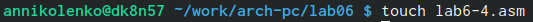{#fig:022 width=70%}

Открываю созданный файл для редактирования, ввожу в него текст программы для вычисления значения выражения (5 + x)^2 - 3 (^ - возведение в степень) (Вариант 15) (рис. [-@fig:023]).

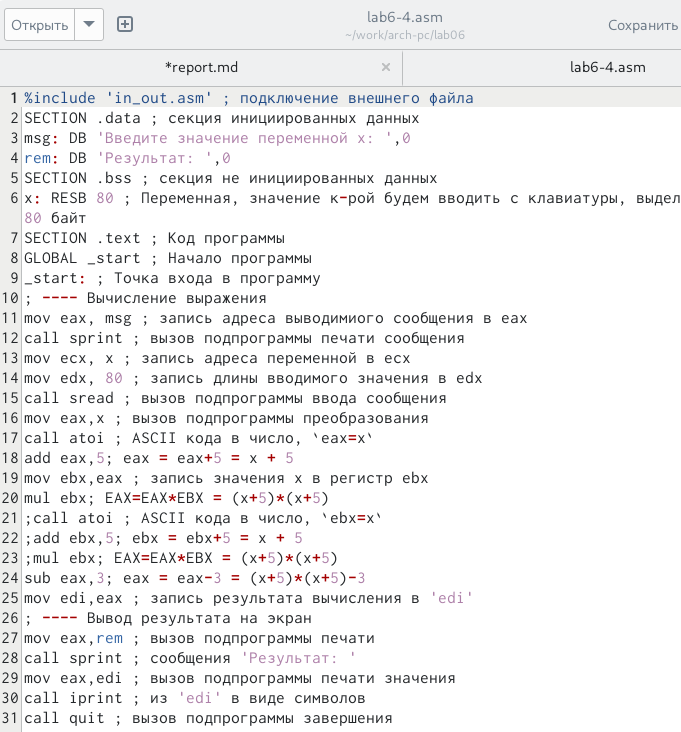{#fig:023 width=70%}

Создаю и запускаю исполняемый файл. При вводе значения 5, вывод - 97. (рис. [-@fig:024]).

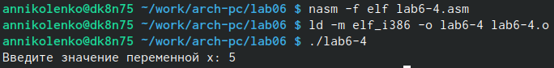{#fig:024 width=70%}

Повторный запуск исполняемого файла с другим занчением x=1, вывод - 33 (рис. [-@fig:025]).

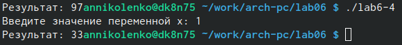{#fig:025 width=70%}

# Листинги программ 

1. Программа вывода значения регистра eax

%include 'in_out.asm'
SECTION .bss
buf1: RESB 80
SECTION .text
GLOBAL _start
_start:
mov eax,'6'
mov ebx,'4'
add eax,ebx
mov [buf1],eax
mov eax,buf1
call sprintLF
call quit

2. Программа вывода значения регистра eax
%include 'in_out.asm'
SECTION .text
GLOBAL _start
_start:
mov eax,'6'
mov ebx,'4'
add eax,ebx
call iprintLF
call quit

3. Программа вычисления выражения 𝑓(𝑥) = (5 ∗ 2 + 3)/3
;--------------------------------
; Программа вычисления выражения
;--------------------------------
%include 'in_out.asm' ; подключение внешнего файла
SECTION .data
div: DB 'Результат: ',0
rem: DB 'Остаток от деления: ',0
SECTION .text
GLOBAL _start
_start:
; ---- Вычисление выражения
mov eax,5 ; EAX=5
mov ebx,2 ; EBX=2
mul ebx ; EAX=EAX*EBX
add eax,3 ; EAX=EAX+3
xor edx,edx ; обнуляем EDX для корректной работы div
mov ebx,3 ; EBX=3
div ebx ; EAX=EAX/3, EDX=остаток от деления
mov edi,eax ; запись результата вычисления в 'edi'
; ---- Вывод результата на экран
mov eax,div ; вызов подпрограммы печати
call sprint ; сообщения 'Результат: '
mov eax,edi ; вызов подпрограммы печати значения
call iprintLF ; из 'edi' в виде символов
mov eax,rem ; вызов подпрограммы печати
call sprint ; сообщения 'Остаток от деления: '
mov eax,edx ; вызов подпрограммы печати значения
call iprintLF ; из 'edx' (остаток) в виде символов
call quit ; вызов подпрограммы завершения

4. Программа вычисления вычисления варианта задания по номеру
студенческого билета
;--------------------------------
; Программа вычисления варианта
;--------------------------------
%include 'in_out.asm'
SECTION .data
msg: DB 'Введите No студенческого билета: ',0
rem: DB 'Ваш вариант: ',0
SECTION .bss
x: RESB 80
SECTION .text
GLOBAL _start
_start:
mov eax, msg
call sprintLF
mov ecx, x
mov edx, 80
call sread
mov eax,x ; вызов подпрограммы преобразования
call atoi ; ASCII кода в число, eax=x
xor edx,edx
mov ebx,20
div ebx
inc edx
mov eax,rem
call sprint
mov eax,edx
call iprintLF
call quit

5. Программа для вычисления значения выражения (5 + x) ^ 2 − 3.
%include 'in_out.asm' ; подключение внешнего файла
SECTION .data ; секция инициированных данных
msg: DB 'Введите значение переменной х: ',0
rem: DB 'Результат: ',0
SECTION .bss ; секция не инициированных данных
x: RESB 80 ; Переменная, значение к-рой будем вводить с клавиатуры, выделенный размер - 80 байт
SECTION .text ; Код программы
GLOBAL _start ; Начало программы
_start: ; Точка входа в программу
; ---- Вычисление выражения
mov eax, msg ; запись адреса выводимиого сообщения в eax
call sprint ; вызов подпрограммы печати сообщения
mov ecx, x ; запись адреса переменной в ecx
mov edx, 80 ; запись длины вводимого значения в edx
call sread ; вызов подпрограммы ввода сообщения
mov eax,x ; вызов подпрограммы преобразования
call atoi ; ASCII кода в число, `eax=x`
add eax,5; eax = eax+5 = x + 5
mov ebx,eax ; запись значения x в регистр ebx
mul ebx; EAX=EAX*EBX = (x+5)*(x+5)
;call atoi ; ASCII кода в число, `ebx=x`
;add ebx,5; ebx = ebx+5 = x + 5
;mul ebx; EAX=EAX*EBX = (x+5)*(x+5)
sub eax,3; eax = eax-3 = (x+5)*(x+5)-3
mov edi,eax ; запись результата вычисления в 'edi'
; ---- Вывод результата на экран
mov eax,rem ; вызов подпрограммы печати
call sprint ; сообщения 'Результат: '
mov eax,edi ; вызов подпрограммы печати значения
call iprint ; из 'edi' в виде символов
call quit ; вызов подпрограммы завершения

# Выводы

При выполнении данной лабораторной работы я освоила арифметические инструкции языка ассемблера NASM.

# Список литературы{.unnumbered}

::: {#refs}
:::

