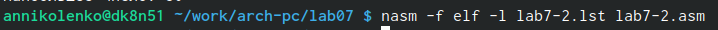

---
## Front matter
title: "Отчет по лабораторной работе №7"
subtitle: "Архитектура компьютера"
author: "Николенко Анна Николаевна"

## Generic otions
lang: ru-RU
toc-title: "Содержание"

## Bibliography
bibliography: bib/cite.bib
csl: pandoc/csl/gost-r-7-0-5-2008-numeric.csl

## Pdf output format
toc: true # Table of contents
toc-depth: 2
lof: true # List of figures
lot: true # List of tables
fontsize: 12pt
linestretch: 1.5
papersize: a4
documentclass: scrreprt
## I18n polyglossia
polyglossia-lang:
  name: russian
  options:
	- spelling=modern
	- babelshorthands=true
polyglossia-otherlangs:
  name: english
## I18n babel
babel-lang: russian
babel-otherlangs: english
## Fonts
mainfont: PT Serif
romanfont: PT Serif
sansfont: PT Sans
monofont: PT Mono
mainfontoptions: Ligatures=TeX
romanfontoptions: Ligatures=TeX
sansfontoptions: Ligatures=TeX,Scale=MatchLowercase
monofontoptions: Scale=MatchLowercase,Scale=0.9
## Biblatex
biblatex: true
biblio-style: "gost-numeric"
biblatexoptions:
  - parentracker=true
  - backend=biber
  - hyperref=auto
  - language=auto
  - autolang=other*
  - citestyle=gost-numeric
## Pandoc-crossref LaTeX customization
figureTitle: "Рис."
tableTitle: "Таблица"
listingTitle: "Листинг"
lofTitle: "Список иллюстраций"
lotTitle: "Список таблиц"
lolTitle: "Листинги"
## Misc options
indent: true
header-includes:
  - \usepackage{indentfirst}
  - \usepackage{float} # keep figures where there are in the text
  - \floatplacement{figure}{H} # keep figures where there are in the text
---

# Цель работы

Цель работы заключается в изучении команд условного и безусловного переходов, в приобретении навыков написания программ с использованием переходов, а также в знакомстве с назначением и структурой файла
листинга

# Задание

1. Проверить работу разных программ с использованием инструкции jmp.
2. Проверить работу программы, которая определяет и выводит на экран наибольшую из 3
целочисленных переменных: A,B и C.
3. Изучить структуры файлы листинга.
4. Напиcать программу нахождения наименьшей из 3 целочисленных переменных a,b,c.
5. Написать программу, которая для введенных с клавиатуры значений x и a вычисляет
значение заданной функции f(x) и выводит результат вычислений.

# Теоретическое введение

Безусловный переход выполняется инструкцией jmp, которая
включает в себя адрес перехода, куда следует передать управление:
jmp <адрес_перехода>

jmp label - переход на метку label
jmp (label в квадратных скобках) -  переход по адресу в памяти, помеченному меткой label
jmp eax -  переход по адресу из регистра eax

Как отмечалось выше, для условного перехода необходима проверка какого-либо условия. В ассемблере команды условного перехода вычисляют условие перехода анализируя флаги из регистра флагов.
Флаг – это бит, принимающий значение 1 («флаг установлен»), если выполнено некоторое условие, и значение 0 («флаг сброшен») в противном случае. Флаги работают независимо друг от друга, и лишь для удобства они помещены в единый регистр — регистр флагов, отражающий текущее состояние процессора (такие как CF PF AF ZF SF)

Инструкция cmp является одной из инструкций, которая позволяет сравнить операнды и выставляет флаги в зависимости от результата сравнения.
Инструкция cmp является командой сравнения двух операндов: 
cmp <операнд_1>, <операнд_2>
Команда cmp, так же как и команда вычитания, выполняет вычитание <операнд_2> - <операнд_1>, но результат вычитания никуда не записывается и единственным результатом команды сравнения является формирование флагов.

Листинг (в рамках понятийного аппарата NASM) — это один из выходных файлов, создаваемых транслятором.
Все ошибки и предупреждения, обнаруженные при ассемблировании, транслятор выводит на экран, и файл листинга не создаётся.
Структура листинга:
* номер строки 
* адрес — это смещение машинного кода от начала текущего сегмента
* машинный код представляет собой ассемблированную исходную строку в виде шестнадцатеричной последовательности
* исходный текст программы 

# Выполнение лабораторной работы
## Реализация переходов в NASM
Создаю каталог для программам лабораторной работы № 7, перехожу в него и создаю файл lab7-1.asm (рис. [-@fig:001]).

{#fig:001 width=70%}

Ввожу в файл lab7-1.asm текст программы с использованием инструкции jmp (рис. [-@fig:002]).

{#fig:002 width=70%}

Создаю исполняемый файл и запускаю его (рис. [-@fig:003]).

{#fig:003 width=70%}

Изменяю текст программы, чтобы она выводила сначала ‘Сообщение № 2’, потом ‘Сообщение№ 1’ и завершала работу (рис. [-@fig:004]).

{#fig:004 width=70%}

Создаю исполняемый файл и запускаю его (рис. [-@fig:005]) (рис. [-@fig:006]).

{#fig:005 width=70%}
{#fig:006 width=70%}

Изменяю текст программы, чтобы она выводила сначала ‘Сообщение № 3’, потом ‘Сообщение№ 2’, а затем ‘Сообщение № 1’ и завершала работу (рис. [-@fig:007]).

{#fig:007 width=70%}

Создаю исполняемый файл и запускаю его (рис. [-@fig:008]).

{#fig:008 width=70%}

Создаю файл lab7-2.asm (рис. [-@fig:009]).

{#fig:009 width=70%}

Ввожу в файл lab7-2.asm текст программы, которая определяет и выводит на экран наибольшую из целочисленных переменных: A,B и C (рис. [-@fig:010]).

{#fig:010 width=70%}

Создаю исполняемый файл и запускаю его несколько раз для разных значений В, чтобы проверить его работу (рис. [-@fig:011]).

{#fig:011 width=70%}

## Изучение структуры файлы листинга

Создаю файл листинга для программы из файла lab7-2.asm, указав ключ -l (рис. [-@fig:012]).

{#fig:012 width=70%}

Открываю файл листинга lab7-2.lst с помощью текстового редактора mcedit (рис. [-@fig:013]).

{#fig:013 width=70%}

объяснение содержимого трёх строк файла листинга:
* в строке 9 содержится номер сторки [8], адресс [00000003], машинный код [803800] и содержимое строки кода [cmp byte [eax], 0] 
* в строке 12 содержится номер сторки [11], адресс [00000009], машинный код [EBF8] и содержимое строки кода [jmp nextchar] 
* в строке 31 содержится номер сторки [30], адресс [0000001A], машинный код [58] и содержимое строки кода [pop eax]

Открываю файл с программой lab7-2.asm и в одной из инструкций с двумя операндами
удаляю один операнд  (рис. [-@fig:014]).

{#fig:014 width=70%}

Выполните трансляцию с получением файла листинга (рис. [-@fig:015]).

{#fig:015 width=70%}

В коде появилась ошибка,а также ее описание появилось в файле листинга (рис. [-@fig:016]).

{#fig:016 width=70%}

# Задания для самостоятельной работы
## 1 пункт самостоятельной работы
Написала программу нахождения наименьшей из 3 целочисленных переменных a,b,c, предварительно создав файл lab7-3.asm (мой вариант: 15) (рис. [-@fig:017]).

{#fig:017 width=70%}

Создаю исполняемый файл и проверяю его работу. Все выполнено верно (рис. [-@fig:018]).

{#fig:018 width=70%}

## 2 пункт самостоятельной работы

Написала программу, которая для введенных с клавиатуры значений x и a вычисляет
значение заданной функции f(x) и выводит результат вычислений. предварительно для этого создала файл lab7-4.asm (мой вариант: 15) (рис. [-@fig:019]).

{#fig:019 width=70%}

Создаю исполняемый файл и проверяю его работу. Все выполнено верно (рис. [-@fig:020]).

{#fig:020 width=70%}

# Выводы

Я изучила основные принципы работы с условным и безусловным переходом в assembler и основы чтения файлов листинга.

# Листинги программ cамостоятельной работы

1. Программа для 1-го пункта самостоятельной работы

%include 'in_out.asm'

section .data
    msg1 db "Наименьшее число:"
    a dd 32
    b dd 6
    c dd 54

section .bss
    min resb 10

section .text
global _start

_start:
    mov eax, msg1
    call sprint

    mov ecx, [a]
    mov [min], ecx ; 'min = A'
    ; ---------- Сравниваем 'A' и 'С' (как числа)
    cmp ecx, [c] ; Сравниваем 'A' и 'С'
    jl check_B ; если 'A<C', то переход на метку 'check_B',
    mov ecx, [c] ; иначе 'ecx = C'
    mov [min], ecx ; 'min = C'
; ---------- Преобразование 'min(A,C)' из символа в число

check_B:
    ; ---------- Сравниваем 'min(A,C)' и 'B' (как числа)
    mov ecx, [min]
    cmp ecx, [b] ; Сравниваем 'min(A,C)' и 'B'
    jl fin ; если 'min(A,C)>B', то переход на 'fin',
    mov ecx, [b] ; иначе 'ecx = B'

    mov [min], ecx

; ---------- Вывод результата
fin:
    mov eax, [min]
    call iprintLF ; Вывод 'min(A,B,C)'
    call quit ; Выход
    
2. Программа для 2-го пункта самостоятельной работы

%include 'in_out.asm'

SECTION .data
input1 db "Введите х: ",0h
input2 db "Ввведите а: ",0h

SECTION .bss
max resb 10
x resb 10
a resb 10

SECTION .text
GLOBAL _start

_start:
mov eax,input1
call sprint

mov ecx,x
mov edx,10
call sread

mov eax,x
call atoi 
mov [x],eax 

mov eax,input2
call sprint

mov ecx,a
mov edx,10
call sread

mov eax,a
call atoi 
mov [a],eax 

mov eax, [x]
mov ebx, [a]
cmp eax, ebx
jge check

mov eax, [a]
mov ebx, 10
add eax, ebx
call iprintLF
call quit

check:
mov eax, [x]
mov ebx, 10
add eax, ebx
call iprintLF
call quit

