---
## Front matter
title: "Отчет по лабораторной работе №8"
subtitle: "Архитектура компьютера"
author: "Николенко Анна Николаевна"

## Generic otions
lang: ru-RU
toc-title: "Содержание"

## Bibliography
bibliography: bib/cite.bib
csl: pandoc/csl/gost-r-7-0-5-2008-numeric.csl

## Pdf output format
toc: true # Table of contents
toc-depth: 2
lof: true # List of figures
lot: true # List of tables
fontsize: 12pt
linestretch: 1.5
papersize: a4
documentclass: scrreprt
## I18n polyglossia
polyglossia-lang:
  name: russian
  options:
	- spelling=modern
	- babelshorthands=true
polyglossia-otherlangs:
  name: english
## I18n babel
babel-lang: russian
babel-otherlangs: english
## Fonts
mainfont: PT Serif
romanfont: PT Serif
sansfont: PT Sans
monofont: PT Mono
mainfontoptions: Ligatures=TeX
romanfontoptions: Ligatures=TeX
sansfontoptions: Ligatures=TeX,Scale=MatchLowercase
monofontoptions: Scale=MatchLowercase,Scale=0.9
## Biblatex
biblatex: true
biblio-style: "gost-numeric"
biblatexoptions:
  - parentracker=true
  - backend=biber
  - hyperref=auto
  - language=auto
  - autolang=other*
  - citestyle=gost-numeric
## Pandoc-crossref LaTeX customization
figureTitle: "Рис."
tableTitle: "Таблица"
listingTitle: "Листинг"
lofTitle: "Список иллюстраций"
lotTitle: "Список таблиц"
lolTitle: "Листинги"
## Misc options
indent: true
header-includes:
  - \usepackage{indentfirst}
  - \usepackage{float} # keep figures where there are in the text
  - \floatplacement{figure}{H} # keep figures where there are in the text
---

# Цель работы

Цель работы заключается в приобретении навыков написания программ с использованием циклов и обработкой аргументов командной строки.

# Задание

1. Проверка работы программы вывода значений регистра ecx с добавлением различных изменений
2. Проверка работы программы, выводящая на экран аргументы командной строки
3. Проверка работы программы вычисления суммы и произведения аргументов командной строки
4. Задания по самостоятельной работе

# Теоретическое введение
##Организация стека
Стек — абстрактный тип данных, представляющий собой список элементов, организованных по принципу LIFO. Стек является частью архитектуры процессора и реализован на аппаратном уровне. Для работы со стеком в процессоре есть специальные регистры (ss, bp, sp) и команды.
Основая функция стека - сохранение адресов возврата и передачи аргументов при вызове процедур. Кроме того, в нём выделяется память для локальных переменных и могут временно храниться значения регистров.
Стек имеет вершину (адрес последнего добавленного элемента, который хранится в ре-
гистре esp (указатель стека)) и дно (противоположный конец стека). Значение, помещённое в стек последним, извлекается первым. 
При помещении значения в стек указатель стека уменьшается, а при извлечении — увеличивается.
Для стека существует две основные операции:
* добавление элемента в вершину стека (push);
* извлечение элемента из вершины стека (pop).

Добавление элемента в стек:
Команда push размещает значение в стеке, т.е. помещает значение в ячейку памяти, на которую указывает регистр esp, после этого значение регистра esp увеличивается на 4.
Данная команда имеет один операнд — значение, которое необходимо поместить в стек.

Извлечение элемента из стека:
Команда pop извлекает значение из стека, т.е. извлекает значение из ячейки памяти, на
которую указывает регистр esp, после этого уменьшает значение регистра esp на 4. У этой
команды также один операнд, который может быть регистром или переменной в памяти.
Нужно помнить, что извлечённый из стека элемент не стирается из памяти и остаётся как
“мусор”, который будет перезаписан при записи нового значения в стек.

# Выполнение лабораторной работы

Создаю каталог для программам лабораторной работы № 8, перехожу в него и создаю файл lab8-1.asm (рис. [-@fig:001]).

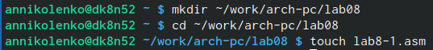{#fig:001 width=70%}

Ввожу программу вывода значений регистра ecx в файл lab8-1.asm (рис. [-@fig:002]).

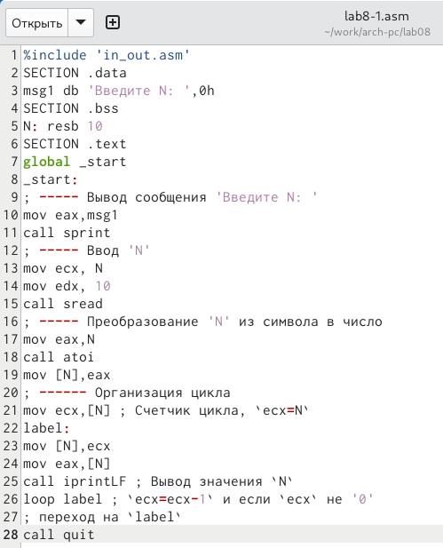{#fig:002 width=70%}

Создаю исполняемый файл и запускаю его (рис. [-@fig:003]).

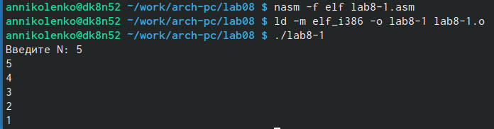{#fig:003 width=70%}

Изменяю текст программы в файле lab8-1.asm, добавив изменение значение регистра ecx в цикле (рис. [-@fig:004]).

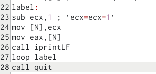{#fig:004 width=70%}

Создаю исполняемый файл и запускаю его (рис. [-@fig:005]).

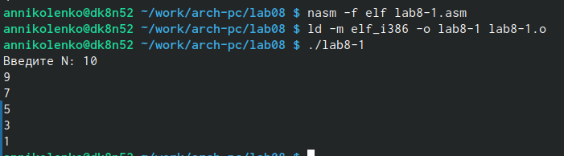{#fig:005 width=70%}

Регистр ecx в цикле принимает нечетные значения. меньшие 10.
Число проходов цикла не соответствует значению 𝑁 введенному с клавиатуры. Получаю результат отличный от ожидаемого: получаю N/2 значений

Вношу изменения в файл lab8-1.asm, добавив команды push и pop (добавления в стек и извлечения из стека) для сохранения значения счетчика цикла loop (рис. [-@fig:006]).

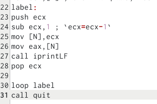{#fig:006 width=70%}

Создаю исполняемый файл и запускаю его (рис. [-@fig:007]).

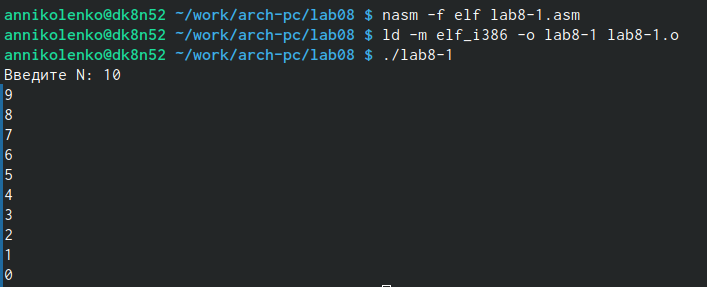{#fig:007 width=70%}

Теперь ввелось N значений.

Создаю файл lab8-2.asm (рис. [-@fig:008]).

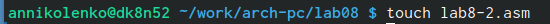{#fig:008 width=70%}

Ввожу программу, выводящая на экран аргументы командной строки в файл lab8-2.asm (рис. [-@fig:009]).

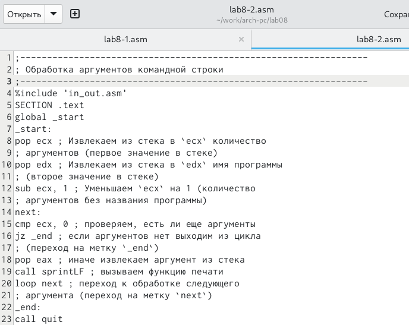{#fig:009 width=70%}

Создаю исполняемый файл и запускаю его (рис. [-@fig:010]).

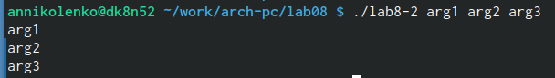{#fig:010 width=70%}

Все аргументы были обработаны программой.

Создаю файл lab8-3.asm (рис. [-@fig:011]).

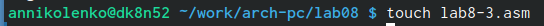{#fig:011 width=70%}

Ввожу программу вычисления суммы аргументов командной строки в файл lab8-3.asm (рис. [-@fig:012]).

{#fig:012 width=70%}

Создаю исполняемый файл и запускаю его (рис. [-@fig:013]).

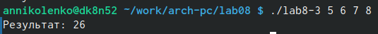{#fig:013 width=70%}

Вношу изменения в файл lab8-3.asm, чтобы она вычисляла произведение аргументов командной строки (рис. [-@fig:014]).

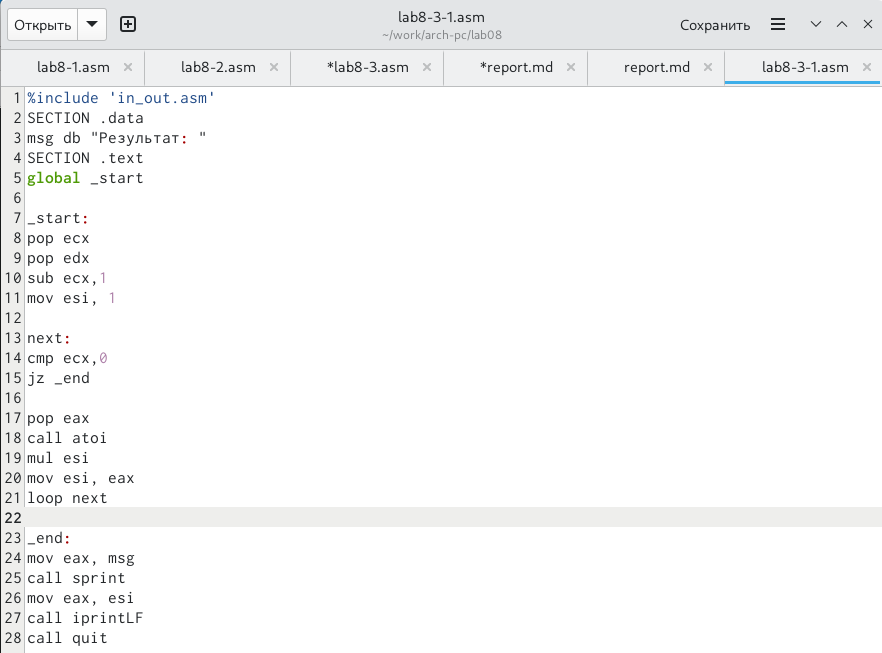{#fig:014 width=70%}

Создаю исполняемый файл и запускаю его (рис. [-@fig:015]).

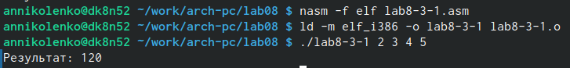{#fig:015 width=70%}

#Самостоятельная работа

Мой вариант: 15

Пишу программу, которая находит сумму значений функции f(x) (рис. [-@fig:016]).

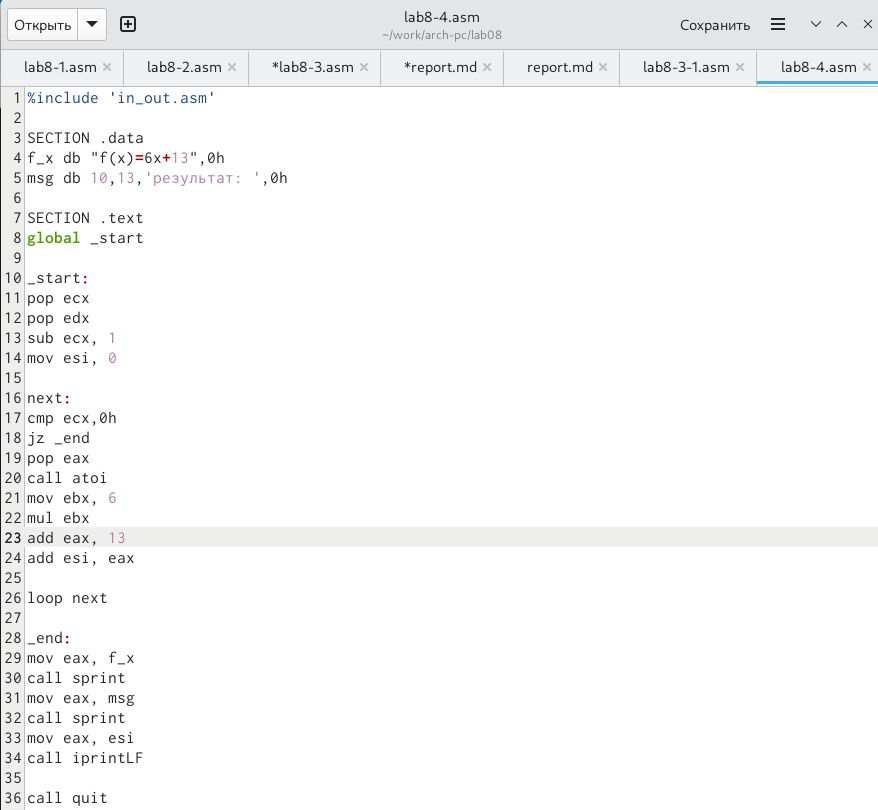{#fig:016 width=70%}

Создаю исполняемый файл и запускаю его (рис. [-@fig:017]).

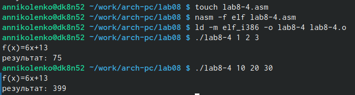{#fig:017 width=70%}

# Выводы
Были полученынавыки по организации циклов и работе со стеком на языке NASM. <3

# Листинги
``` NASM
%include 'in_out.asm'

SECTION .data
f_x db "f(x)=6x+13",0h
msg db 10,13,'результат: ',0h

SECTION .text
global _start

_start:
pop ecx
pop edx
sub ecx, 1
mov esi, 0

next:
cmp ecx,0h
jz _end
pop eax
call atoi
mov ebx, 6                                                                                 
mul ebx
add eax, 13
add esi, eax

loop next

_end:
mov eax, f_x
call sprint
mov eax, msg
call sprint
mov eax, esi
call iprintLF

call quit
```
