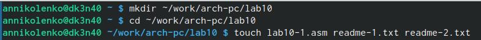
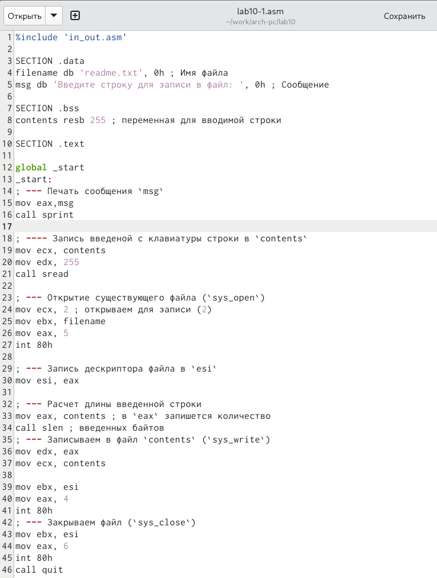
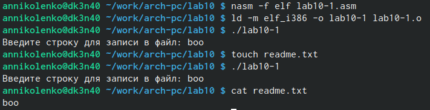
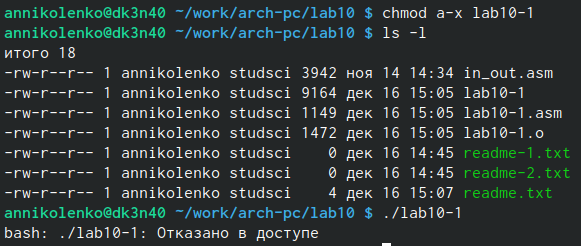
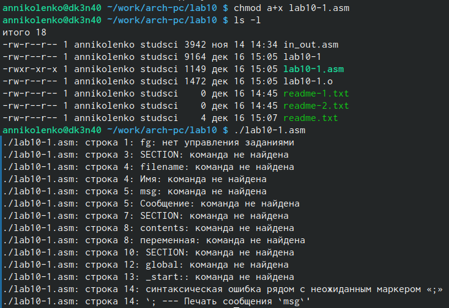
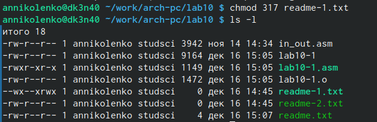
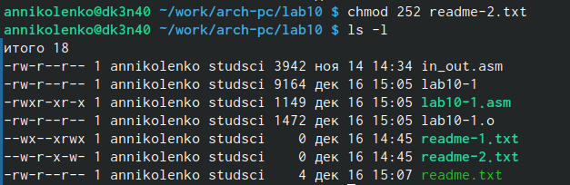
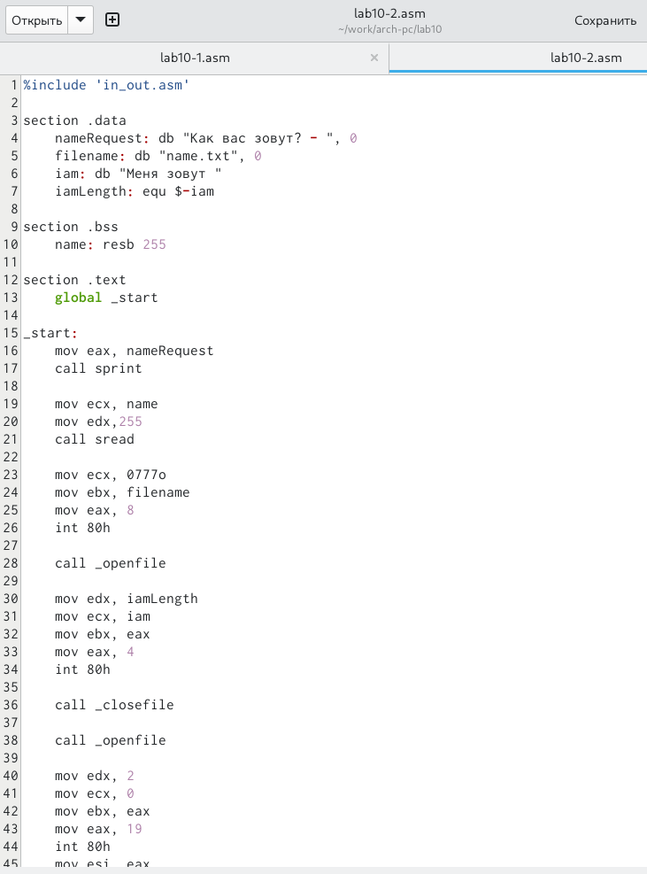
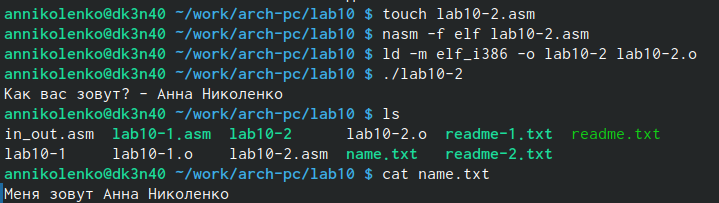

---
## Front matter
title: "Отчет по лабораторной работе №8"
subtitle: "Архитектура компьютера"
author: "Николенко Анна Николаевна"

## Generic otions
lang: ru-RU
toc-title: "Содержание"

## Bibliography
bibliography: bib/cite.bib
csl: pandoc/csl/gost-r-7-0-5-2008-numeric.csl

## Pdf output format
toc: true # Table of contents
toc-depth: 2
lof: true # List of figures
lot: true # List of tables
fontsize: 12pt
linestretch: 1.5
papersize: a4
documentclass: scrreprt
## I18n polyglossia
polyglossia-lang:
  name: russian
  options:
	- spelling=modern
	- babelshorthands=true
polyglossia-otherlangs:
  name: english
## I18n babel
babel-lang: russian
babel-otherlangs: english
## Fonts
mainfont: PT Serif
romanfont: PT Serif
sansfont: PT Sans
monofont: PT Mono
mainfontoptions: Ligatures=TeX
romanfontoptions: Ligatures=TeX
sansfontoptions: Ligatures=TeX,Scale=MatchLowercase
monofontoptions: Scale=MatchLowercase,Scale=0.9
## Biblatex
biblatex: true
biblio-style: "gost-numeric"
biblatexoptions:
  - parentracker=true
  - backend=biber
  - hyperref=auto
  - language=auto
  - autolang=other*
  - citestyle=gost-numeric
## Pandoc-crossref LaTeX customization
figureTitle: "Рис."
tableTitle: "Таблица"
listingTitle: "Листинг"
lofTitle: "Список иллюстраций"
lotTitle: "Список таблиц"
lolTitle: "Листинги"
## Misc options
indent: true
header-includes:
  - \usepackage{indentfirst}
  - \usepackage{float} # keep figures where there are in the text
  - \floatplacement{figure}{H} # keep figures where there are in the text
---

# Цель работы

Цель заключается в приобритении навыков работы с файлами в языке NASM и научиться управлять правами доступа к файлам.

# Задание

1. Проверка корректной работы программы записи в файл сообщения.
2. Изучаем влияние прав доступа на работу с файлами.
3. Самостоятельная работа.

# Теоретическое введение

Права доступа — совокупность правил, регламентирующих порядок и условия доступа субъекта к объектам информационной системы ( , её носителям, процессам и другим ресурсам) установленных правовыми документами или собственником, владельцем информации.


# Выполнение лабораторной работы

Создаю рабочую дерикторию и файл (рис. @fig:001).

{#fig:001 width=70%}

Записываю туда код программы из листинга (рис. @fig:002).

{#fig:002 width=70%}

Создаю исполняемый файл, запускаю его, проверяю корректность работы (рис. [-@fig:003]).

{#fig:003 width=70%}

С помощью команды chmod запрещаю исполнение для файла lab10-1 (рис. [-@fig:004])

{#fig:004 width=70%}

Как и ожидалось, мы не смогли исполнить этот файл, если запретить исполнение файла, то исполнить его станет невозможно.

Когда я разрешаю исполнение файла с расширением .asm и собственно исполняю его, то мы увидем множество ошибок, ведь этот файл не предназначен для такого использования (рис. [-@fig:005]).

{#fig:005 width=70%}

С помощью команды chmode изменяю права доступа к файлу readme-1.txt в соответствии с вариантом 15 С помощью команды ls -l убеждаюсь в правильности выполнения задания (рис. @fig:006). 

{#fig:006 width=70%}

С помощью команды chmode изменяю права доступа к файлу readme-2.txt в соответствии с вариантом 15 С помощью команды ls -l убеждаюсь в правильности выполнения задания (рис. @fig:007). 

{#fig:007 width=70%}

# Выполнение самостоятельной работы

Создаю файл lab10-2.asm, в который ввожу текст программы, которая спрашивает как меня зовут, а потом записывает это в созданный ею же файл (рис. @fig:008).

{#fig:008 width=70%}

Создаю исполняемый файл и проверяю его работу. Программа сработала корректно (рис. @fig:009). 

{#fig:009 width=70%}

#Листинг 

```nasm 

%include 'in_out.asm'

section .data
    nameRequest: db "Как вас зовут? - ", 0
    filename: db "name.txt", 0
    iam: db "Меня зовут "
    iamLength: equ $-iam

section .bss
    name: resb 255

section .text
    global _start

_start:
    mov eax, nameRequest
    call sprint

    mov ecx, name
    mov edx,255
    call sread
    
    mov ecx, 0777o 
    mov ebx, filename
    mov eax, 8 
    int 80h

    call _openfile

    mov edx, iamLength 
    mov ecx, iam 
    mov ebx, eax 
    mov eax, 4
    int 80h

    call _closefile
    
    call _openfile

    mov edx, 2
    mov ecx, 0 
    mov ebx, eax
    mov eax, 19 
    int 80h
    mov esi, eax
    mov eax, name
    call slen
    mov edi, eax
    mov eax, esi

    mov edx, edi 
    mov ecx, name
    mov eax, 4
    int 80h

    call _closefile

_end:
    call quit

_openfile:
    mov ecx, 2 
    mov ebx, filename
    mov eax, 5
    int 80h
    ret

_closefile:
    mov ebx, eax
    mov eax, 6
    int 80h
    ret
    
```    
    
    

# Выводы

Я приобрела навыки по работе с файлами в NASM и правами доступа к файлам.


